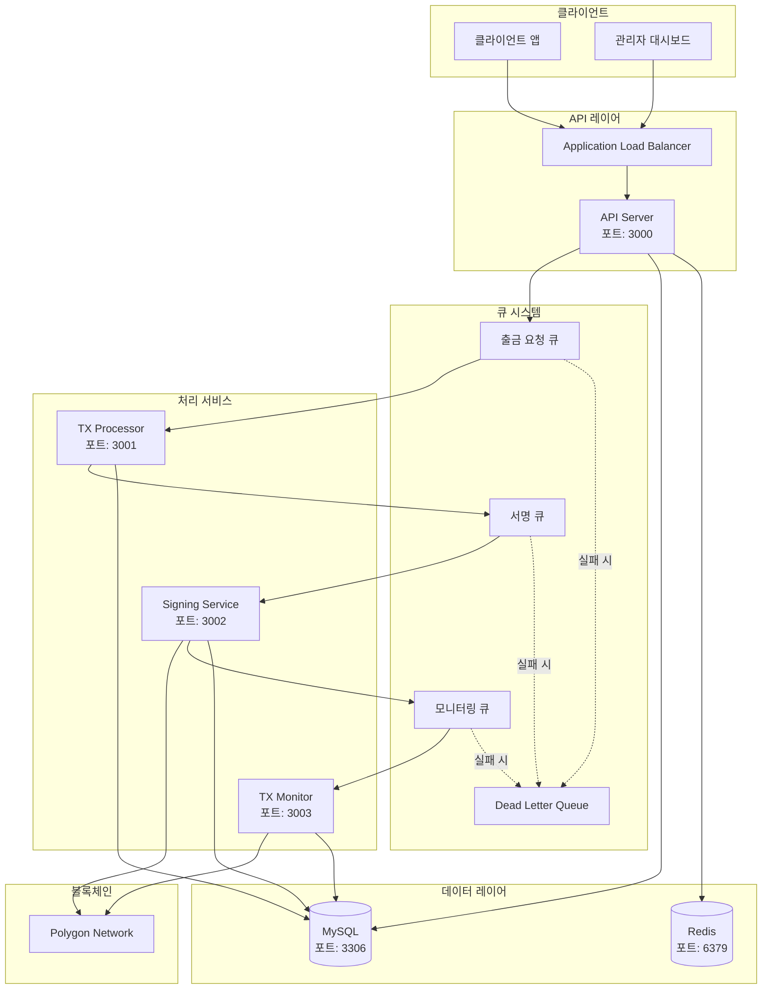

# 시스템 아키텍처

## 개요

자산 출금 시스템은 마이크로서비스 아키텍처를 기반으로 구축된 이벤트 기반 시스템입니다. 각 서비스는 특정 도메인에 대한 책임을 가지며, AWS SQS를 통해 비동기적으로 통신합니다.

## 시스템 구성도



## 서비스별 상세 설명

### 1. API Server (api-server)
- **역할**: HTTP API 게이트웨이
- **주요 기능**:
  - 사용자 인증 및 권한 관리
  - 출금 요청 검증 및 접수
  - 트랜잭션 상태 조회
  - 속도 제한 및 API 보안
- **기술 스택**: Express.js, TypeScript, JWT

### 2. Transaction Processor (tx-processor)
- **역할**: 트랜잭션 처리 오케스트레이터
- **주요 기능**:
  - 출금 요청 큐 소비
  - 비즈니스 로직 검증
  - 서명 작업 큐잉
  - 워크플로우 조정
- **기술 스택**: Node.js Worker, SQS Consumer

### 3. Signing Service (signing-service)
- **역할**: 트랜잭션 서명 및 브로드캐스트
- **주요 기능**:
  - 안전한 키 관리
  - 트랜잭션 서명
  - 가스 가격 최적화
  - 블록체인 브로드캐스트
- **기술 스택**: Ethers.js, AWS KMS

### 4. Transaction Monitor (tx-monitor)
- **역할**: 트랜잭션 상태 모니터링
- **주요 기능**:
  - 블록체인 상태 추적
  - 확인 수 모니터링
  - 실패 감지 및 재시도
  - 웹훅 알림 발송
- **기술 스택**: Ethers.js, WebSocket

## 데이터 플로우

### 출금 요청 플로우
```
1. 클라이언트 → API Server: 출금 요청 제출
2. API Server → MySQL: 요청 저장 (상태: PENDING)
3. API Server → SQS: 메시지 큐잉
4. TX Processor → SQS: 메시지 소비
5. TX Processor → MySQL: 상태 업데이트 (상태: PROCESSING)
6. TX Processor → Signing Queue: 서명 요청
7. Signing Service → 블록체인: 트랜잭션 제출
8. Signing Service → MySQL: 트랜잭션 해시 저장
9. Signing Service → Monitor Queue: 모니터링 요청
10. TX Monitor → 블록체인: 상태 확인
11. TX Monitor → MySQL: 최종 상태 업데이트 (상태: COMPLETED/FAILED)
```

## 보안 아키텍처

### 네트워크 보안
- VPC 내 프라이빗 서브넷에 서비스 배치
- 보안 그룹을 통한 포트 제한
- API Gateway에만 퍼블릭 액세스 허용

### 애플리케이션 보안
- JWT 기반 인증
- API 키 관리
- 속도 제한 및 DDoS 보호
- 입력 검증 및 살균

### 데이터 보안
- 전송 중 암호화 (TLS)
- 저장 시 암호화 (AES-256)
- 키 관리 (AWS KMS)
- 감사 로깅

## 확장성 전략

### 수평 확장
- 각 서비스는 독립적으로 확장 가능
- Kubernetes HPA를 통한 자동 확장
- 큐 깊이 기반 워커 스케일링

### 성능 최적화
- Redis 캐싱 레이어
- 데이터베이스 읽기 복제본
- CDN을 통한 정적 자산 제공
- 배치 처리 최적화

## 모니터링 및 관찰성

### 메트릭 수집
- Prometheus를 통한 메트릭 수집
- 커스텀 비즈니스 메트릭
- 시스템 리소스 모니터링

### 로깅
- 중앙집중식 로깅 (ELK Stack)
- 구조화된 JSON 로그
- 상관 ID를 통한 추적

### 추적
- 분산 추적 (Jaeger)
- 서비스 간 요청 추적
- 성능 병목 현상 식별

## 장애 복구

### 고가용성
- 다중 AZ 배포
- 로드 밸런서를 통한 트래픽 분산
- 상태 검사 및 자동 복구

### 백업 및 복구
- 자동화된 데이터베이스 백업
- 특정 시점 복구 지원
- 재해 복구 계획

### 서킷 브레이커
- 서비스 간 장애 전파 방지
- 자동 폴백 메커니즘
- 점진적 복구 전략