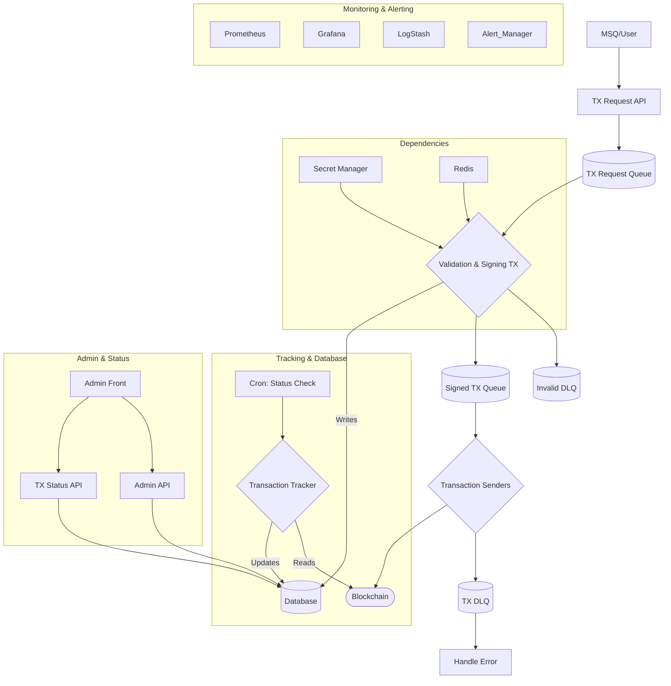

# Blockchain Withdrawal System Architecture

## 1. Overview

This document defines the architecture of a blockchain withdrawal system designed to operate in an AWS environment. The system aims to securely protect user assets, process withdrawal requests quickly and reliably, and scale to handle high-volume traffic.

## 2. Architecture Diagram and Data Flow

- **Request Reception**: Client withdrawal requests are received through the `TX Request API` and queued in the `TX Request Queue`.
- **Validation & Signing**: The `Validation & Signing TX` component processes requests sequentially from the queue. It verifies user balances in `Redis` and loads private keys from `Secret Manager` to sign transactions. Invalid requests (e.g., insufficient balance, address errors) are moved to the `Invalid Dead Letter Queue`.
- **Transaction Broadcasting**: Signed transactions are forwarded to the `Signed TX Queue`. The `Transaction Senders` component retrieves transactions from this queue and broadcasts them to the blockchain network. Failed transmissions are isolated in the `TX Dead Letter Queue`.
- **Status Tracking & Monitoring**: `Cron`-based `Transaction Status Check` and `Verify Sent Transactions` jobs work with the `Transaction Tracker` to continuously monitor transaction status on the blockchain and update final results in the database.
- **Admin Functions**: `Admin Front` provides system status and transaction processing monitoring through `Admin API` and `TX Status API`.
- **Monitoring & Alerting**: `Prometheus`, `Grafana`, and `LogStash` collect and visualize system-wide metrics and logs, while `Alert Manager` sends notifications to the operations team when predefined thresholds are exceeded.



[https://www.figma.com/board/HvHzZrTw4E2pgQH7DBAju4/Blockchain-Withdrawal-System?node-id=0-1&t=hocJvQMkWSxOoMDD-1](https://www.figma.com/board/HvHzZrTw4E2pgQH7DBAju4/Blockchain-Withdrawal-System?node-id=0-1&t=hocJvQMkWSxOoMDD-1)

## 3. Key Components

### 3.1. API and Admin Interface

- **TX Request API**: Gateway that receives withdrawal requests from external sources. It validates basic request format before forwarding to the `TX Request Queue`.
- **TX Status API / Admin API**: APIs used to query transaction status and modify system settings from the admin interface.
- **Admin Front**: Web-based admin interface where developers and operators can view withdrawal history, error transactions, and take necessary actions.

### 3.2. Message Queues (Amazon SQS)

- **TX Request Queue**: Primary queue storing withdrawal requests awaiting processing.
- **Signed TX Queue**: Queue holding signed transactions awaiting blockchain transmission.
- **Invalid Dead Letter Queue**: DLQ (Dead-Letter Queue) isolating requests that failed validation and signing.
- **TX Dead Letter Queue**: DLQ isolating transactions that failed blockchain transmission.

### 3.3. Withdrawal Processing Workers

- **Validation & Signing TX**: Core worker processing requests from the `TX Request Queue`. It verifies balances in `Redis`, retrieves keys from `Secret Manager`, and signs transactions.
- **Transaction Senders**: Responsible for retrieving signed transactions from the `Signed TX Queue` and broadcasting them to the blockchain network.

### 3.4. Data Storage

- **Database (DB)**: Stores all persistent data including transaction status and last scanned block numbers. (e.g., Amazon RDS, Aurora)
- **Redis**: Caches frequently accessed data such as user balances and token information (ABIs) to improve response times and reduce database load. (e.g., Amazon ElastiCache)

### 3.5. Status Tracking and Schedulers

- **Transaction Tracker**: Component that tracks the status (confirmation status, etc.) of transactions sent to the blockchain.
- **Cron Jobs**: Periodic tasks executed via Kubernetes CronJob or AWS EventBridge. They monitor long-pending transactions and verify final status of sent transactions to update the database.

### 3.6. Monitoring and Alerting System

- **Prometheus / Grafana / LogStash / Alert Manager**: Critical components that collect and visualize system metrics and logs. `Alert Manager` sends notifications to the operations team when anomalies are detected.

## 4. Withdrawal Process Flow

1. **Request Reception**: `TX Request API` receives withdrawal requests and sends messages to the `TX Request Queue`.
2. **Validation & Signing**: `Validation & Signing TX` worker retrieves and processes messages from the queue.
   - Verifies available balance in `Redis`.
   - Securely loads private keys from `AWS Secrets Manager`.
   - Signs transactions and forwards to `Signed TX Queue`.
   - On error (insufficient balance, etc.), requests are sent to the `Invalid Dead Letter Queue`.
3. **Blockchain Transmission**: `Transaction Senders` worker retrieves signed transactions from the `Signed TX Queue`.
   - Broadcasts transactions to the blockchain network via nodes.
   - On transmission failure (nonce errors, insufficient gas, etc.), transactions are sent to the `TX Dead Letter Queue`.
4. **Status Tracking**: `Transaction Tracker` and periodic `Cron Jobs` query the blockchain for transactions marked as 'processing' in the database.
5. **Completion Processing**: When transactions are successfully included in blocks with sufficient confirmations, the database status is updated to `COMPLETED`, completing the process.
6. **Error Handling**: Messages in `Invalid/TX Dead Letter Queue` are processed according to defined `Handle Error` logic. (e.g., operator notifications, manual reprocessing interface)

## 5. Key Technology Stack and AWS Considerations

- **Compute**: Each API and worker is containerized (Docker) and operated on Amazon EKS (Elastic Kubernetes Service).
- **Secrets Management**: Private keys are stored in **AWS Secrets Manager** with minimized access permissions, allowing only the `Validation & Signing TX` worker to access them via IAM Roles.
- **Queuing**: **Amazon SQS** is used to configure standard queues and DLQs. Worker (Pod) count is automatically adjusted based on queue message volume (e.g., using KEDA) for elastic request processing.
- **Monitoring**: **Amazon Managed Service for Prometheus/Grafana** integrated with **Amazon CloudWatch** to build a robust monitoring and alerting pipeline.

## 6. Improvements

- **Dead Letter Queue Processing Automation**: The `Handle Error` component is critical for system stability. When messages are received in DLQs, CloudWatch Alarms should immediately notify the operations team, and the Admin Front should provide functionality to view, reprocess, or discard these items.
- **Network Security Enhancement**: Communication between components should be strictly controlled using Security Groups and NACLs within AWS VPC. For example, the `Validation & Signing` worker should have network rules allowing access only to essential services like `Secrets Manager`, `Redis`, and `DB`.
- **Blockchain Endpoint Redundancy and Failover**: Dependency on a single blockchain endpoint (node) can become a single point of failure (SPOF) for the entire system. Multiple endpoints should be configured including various providers (Infura, Alchemy, etc.) or self-operated nodes, with periodic health checks and automatic failover logic to ensure service continuity when specific endpoints fail.

## 7. Implemented Technology Stack (Phase 1 Complete)

### 7.1 Current Implementation Status

- **ORM**: Prisma (MySQL)
- **API Framework**: Express.js + TypeScript
- **Queue**: LocalStack SQS (Development) → AWS SQS (Production planned)
- **Testing**: Jest + Supertest
- **Documentation**: OpenAPI 3.0 (Swagger)
- **Container**: Docker + Docker Compose

### 7.2 Planned Technology Stack

- **Container Orchestration**: Amazon EKS
- **CI/CD**: GitHub Actions / Jenkins
- **Infrastructure as Code**: Terraform
- **Monitoring**: Prometheus + Grafana
- **Logging**: ELK Stack (Elasticsearch, LogStash, Kibana)
- **APM**: AWS X-Ray or Datadog

## 8. Development and Deployment Process

### 8.1 Branch Strategy

- **main**: Production branch
- **develop**: Development integration branch
- **feature/\***: Feature development branches
- **hotfix/\***: Emergency fix branches

### 8.2 Code Review Process

- Automated tests run on PR creation
- Minimum 1 reviewer approval required
- Security-related changes require additional security team review
- Maintain code coverage above 80%

### 8.3 Deployment Pipeline

- **Development**: feature branch → develop → automatic deployment to dev environment
- **Staging**: develop → staging branch → staging environment
- **Production**: staging → main → Blue-Green deployment
- **Rollback**: Immediate switch to previous version available

### 8.4 Environment Configuration

- **Local**: Docker Compose + LocalStack
- **Dev**: EKS Dev Cluster + RDS Dev
- **Staging**: Same configuration as Production (scaled down)
- **Production**: Multi-AZ EKS + Aurora MySQL

## 9. Operational Goals and SLA

### 9.1 Availability

- **Target**: 99.9% uptime (monthly downtime < 43 minutes)
- **Planned Maintenance**: Once per month, 2-4 AM (KST)
- **Zero-downtime Deployment**: Blue-Green deployment

### 9.2 Performance

- **API Response Time**:
  - P50 < 100ms
  - P95 < 200ms
  - P99 < 500ms
- **Transaction Processing**:
  - Request receipt → Blockchain transmission: < 30 seconds
  - Complete processing (including confirmations): < 5 minutes (varies by network conditions)
- **Concurrent Processing Capacity**: 10,000 TPS

### 9.3 Recovery Objectives

- **RTO (Recovery Time Objective)**: 30 minutes
- **RPO (Recovery Point Objective)**: 5 minutes
- **Backup Schedule**:
  - Database: Real-time replication + daily snapshots
  - Configuration and code: Git-based version control

### 9.4 Security Objectives

- **Vulnerability Scanning**: Weekly automated scans
- **Penetration Testing**: Quarterly
- **Security Patches**: Critical - within 24 hours, High - within 1 week
- **Access Permission Review**: Monthly permission audits

## 10. Incident Response Scenarios

### 10.1 Incident Severity Levels

- **P1 (Critical)**: Complete service outage, risk of asset loss
- **P2 (Major)**: Major feature failure, severe performance degradation
- **P3 (Minor)**: Partial feature failure, workaround available
- **P4 (Low)**: Usability issues, not urgent

### 10.2 Response Procedures

1. **Detection**: Monitoring alerts or user reports
2. **Classification**: Determine severity level and assign responders
3. **Response**:
   - P1: Response within 15 minutes, all team members mobilized
   - P2: Response within 30 minutes
   - P3-P4: Handled during business hours
4. **Recovery**: Remove root cause and restore service
5. **Post-mortem**: Create RCA (Root Cause Analysis) and prevent recurrence

### 10.3 Emergency Contact Network

- On-call engineer rotation (weekly)
- Alert escalation via PagerDuty
- Incident response War Room (Slack channel)

## 11. API Server Implementation Details

### 11.1 API Server Overview

The API Server (withdrawal-api) serves as the gateway for the withdrawal system and is the entry point for all withdrawal requests. It is implemented with Express.js and TypeScript, and integrates with MySQL database through Prisma ORM.

### 11.2 Core Endpoint Details

#### 11.2.1 POST /withdrawal/request
**Purpose**: Create a new withdrawal request and queue it for processing

**Processing Flow**:
1. **Request Validation**
   - Verify required fields: amount, toAddress, tokenAddress, network
   - Validate amount (positive number, numeric format)
   - Validate network (currently only polygon supported)

2. **Request ID Generation**
   - Format: `tx-{timestamp}-{random}`
   - Example: `tx-1752415010939-j2egehq6a`
   - Uniqueness guaranteed by timestamp and random string

3. **Database Storage**
   ```typescript
   await db.withdrawalRequest.create({
     data: {
       requestId: requestId,
       amount: amount,
       currency: getCurrencyFromTokenAddress(tokenAddress),
       toAddress: toAddress,
       tokenAddress: tokenAddress,
       network: network,
       status: 'PENDING'
     }
   });
   ```

4. **SQS Queue Transmission**
   - Send WithdrawalRequest object to tx-request-queue
   - Message queuing for asynchronous processing

5. **Response Return**
   - Success: 201 Created with requestId
   - Failure: 400/500 with error details

#### 11.2.2 GET /withdrawal/status/:id
**Purpose**: Query current status of a specific withdrawal request

**Processing Flow**:
1. **Request Lookup**
   - Search withdrawalRequest table by requestId
   - Return 404 if not found

2. **Transaction Information Check**
   - If status is COMPLETED/BROADCASTING
   - Query related transaction from transaction table
   - Include txHash information

3. **Response Construction**
   ```typescript
   {
     id: requestId,
     status: TransactionStatus,
     transactionHash?: string,
     error?: string,
     createdAt: Date,
     updatedAt: Date
   }
   ```

#### 11.2.3 GET /withdrawal/queue/status
**Purpose**: Monitor current status of withdrawal processing queue

**Processing Flow**:
1. **SQS Queue Status Query**
   - Call AWS GetQueueAttributes API
   - Check ApproximateNumberOfMessages

2. **Processing Request Count**
   - Aggregate VALIDATING/SIGNING/BROADCASTING statuses from database
   ```typescript
   const processingCount = await db.withdrawalRequest.count({
     where: {
       status: { in: ['VALIDATING', 'SIGNING', 'BROADCASTING'] }
     }
   });
   ```

3. **Response Format**
   ```json
   {
     "tx-request": {
       "size": 5,
       "processing": 2
     }
   }
   ```

#### 11.2.4 GET /withdrawal/queue/items
**Purpose**: View actual messages in queue (for debugging)

**Processing Flow**:
1. **Non-destructive Message Reading**
   - visibilityTimeout: 0 for immediate reusability
   - Query up to 10 messages

2. **Response Data**
   - Queue URL
   - Message count
   - Message bodies with truncated receipt handles

### 11.3 Token Currency Mapping Logic

```typescript
function getCurrencyFromTokenAddress(tokenAddress: string): string {
  // Zero address = Native token (ETH on Polygon)
  if (tokenAddress === '0x0000000000000000000000000000000000000000') {
    return 'ETH';
  }
  
  // Token address mapping
  const tokenMap: { [key: string]: string } = {
    '0xdAC17F958D2ee523a2206206994597C13D831ec7': 'USDT',
    '0x6B175474E89094C44Da98b954EedeAC495271d0F': 'DAI',
    '0xA0b86a33E6441C0D16C8fA7b13A4e8Da1D44ce9c': 'USDC'
  };
  
  return tokenMap[tokenAddress] || 'TOKEN';
}
```

### 11.4 Error Handling Strategy

1. **Validation Failure (400 Bad Request)**
   - Missing required fields
   - Invalid amount format
   - Unsupported network

2. **Resource Not Found (404 Not Found)**
   - Withdrawal request not found

3. **Server Error (500 Internal Server Error)**
   - Database connection failures
   - Queue service unavailable
   - Unexpected exceptions

### 11.5 Security Considerations

1. **Input Validation**
   - Strict validation of all input values
   - SQL Injection prevention (Prisma parameterized queries)

2. **API Response**
   - Prevent exposure of sensitive information
   - Exclude system information from error messages

3. **Request Limiting**
   - Rate Limiting implementation planned
   - DDoS attack prevention

### 11.6 Performance Optimization

1. **Database Indexes**
   - Unique index on requestId
   - Regular index on status (for fast filtering)

2. **Asynchronous Processing**
   - Asynchronous message processing via SQS
   - API returns immediate response

3. **Connection Pooling**
   - Prisma connection pooling
   - Database connection reuse

### 11.7 Monitoring Points

1. **API Metrics**
   - Request rate per endpoint
   - Response time (P50, P95, P99)
   - Error rate by status code

2. **Queue Metrics**
   - Queue depth
   - Message age
   - Processing rate

3. **Database Metrics**
   - Query performance
   - Connection pool usage
   - Transaction status distribution
