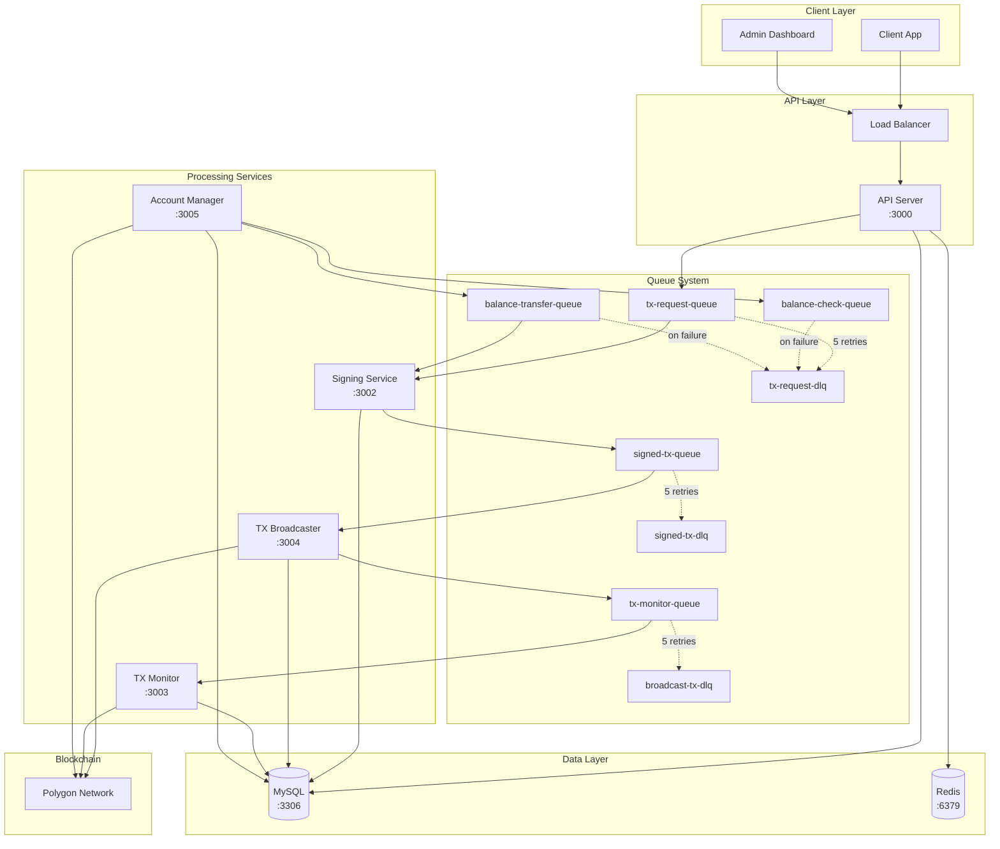

# Asset Withdrawal System

High-throughput Polygon blockchain withdrawal system with Multicall3 batch processing. Handles massive volumes of cryptocurrency withdrawals, processing tens of thousands of transactions efficiently. Features 10-100x faster speeds and up to 70% gas cost reduction.

## 📁 Project Structure

```
├── apps/                        # Applications
│   ├── api-server/              # HTTP API gateway (receives withdrawal requests)
│   ├── signing-service/         # High-throughput transaction signer (Multicall3 batch)
│   ├── tx-broadcaster/          # Blockchain broadcaster (sends signed transactions)
│   ├── tx-monitor/              # Transaction monitor (tracks blockchain status)
│   ├── account-manager/         # Automated balance management for sub-accounts
│   └── admin-ui/                # Admin web interface (React + Tailwind CSS)
├── packages/                    # Shared libraries
│   ├── database/                # Prisma ORM and database services
│   └── shared/                  # Common utilities, types, and validators
├── docker/                      # Docker configuration
│   ├── docker-compose.yaml      # Main services (MySQL, LocalStack)
│   └── scripts/                 # Initialization scripts
├── prisma/                      # Database schema and migrations
├── docs/                        # Documentation
│   ├── introduce.md             # Architecture overview
│   └── plan.md                  # Development plan
└── CLAUDE.md                    # Development guidelines
```

## 🚀 Getting Started

### Prerequisites

- Node.js 18+
- Docker and Docker Compose
- AWS CLI (for LocalStack)
- Hardhat (for local blockchain development)

### Quick Start

```bash
# Start all services including local blockchain
docker-compose -f docker/docker-compose.yaml up -d

# View logs
docker-compose -f docker/docker-compose.yaml logs -f

# Stop all services
docker-compose -f docker/docker-compose.yaml down
```

### Environment Configuration

Create a `.env` file in the root directory. See [Setup Guide](./docs/SETUP.md#environment-variables) for detailed configuration.

## 📍 Service Endpoints

- **API Server**: http://localhost:3000
- **Swagger Docs**: http://localhost:3000/api-docs
- **Admin UI**: http://localhost:3006
- **SQS Admin UI**: http://localhost:3999
- **LocalStack**: http://localhost:4566

## 📋 Quick Commands

```bash
# Development
npm run dev                     # Start all services
npm run build                   # Build all services
npm run lint                    # Check code style
npm run typecheck               # TypeScript check

# Database
npm run db:migrate              # Run migrations
npm run db:seed                 # Seed data
```

For detailed commands and setup, see [Setup Guide](./docs/SETUP.md)

## 🏗️ Architecture

### System Overview



### Core Services

**API Server** - HTTP gateway handling withdrawal requests, authentication, and status queries

**Signing Service** - High-throughput transaction processor with:

- Multi-instance support with atomic message claiming
- Intelligent batch processing via Multicall3 (10-100x faster)
- Dynamic batch optimization based on gas savings
- Redis-based nonce management

**TX Broadcaster** - Broadcasts signed transactions to Polygon with retry logic

**TX Monitor** - Tracks blockchain confirmations and handles failed transactions

**Admin UI** - React dashboard for system management and monitoring

**Account Manager** - Automated balance management system that:

- Monitors sub-account balances periodically
- Automatically transfers funds from main account when below threshold
- Optimizes gas costs through batch transfers
- Provides REST API for manual balance management

### Key Features

- **High Throughput**: Process tens of thousands of transactions efficiently
- **Batch Processing**: Multicall3 integration for 10-100x speed improvement
- **Gas Optimization**: 20-70% gas cost reduction through batching
- **Multi-Instance**: Horizontal scaling with atomic message processing
- **Fault Tolerance**: DLQ handling and automatic retry mechanisms
- **Real-time Monitoring**: Admin UI and SQS dashboard
- **Multi-Chain Support**: Polygon, Ethereum, BSC, and localhost (Hardhat) chains
- **Local Development**: Hardhat node with 1-second mining for fast testing
- **Automated Balance Management**: Account Manager maintains optimal sub-account balances
- **DLQ Error Recovery**: Automatic error classification and recovery strategies
- **Smart Error Handling**: Distinguishes permanent failures from retryable errors

## 🔧 API Reference

### Authentication

- `POST /auth/register` - User registration
- `POST /auth/login` - User login
- `GET /auth/me` - Get current user info (requires authentication)

### Withdrawal Operations

- `POST /withdrawal/request` - Submit withdrawal request
- `GET /withdrawal/status/:id` - Check withdrawal status
- `GET /withdrawal/request-queue/status` - Request queue metrics
- `GET /withdrawal/tx-queue/status` - Transaction queue metrics

Full API documentation available at http://localhost:8080/api-docs

## 🏗️ Local Development

For Hardhat blockchain setup and testing, see [Setup Guide](./docs/SETUP.md#hardhat-local-blockchain)

## 🛡️ Security

- JWT authentication with refresh tokens
- AES-256-GCM encryption for private keys
- AWS Secrets Manager for sensitive data
- Comprehensive audit logging
- Input validation and rate limiting

## 🧪 Testing

See [Setup Guide](./docs/SETUP.md#testing) for testing commands and strategies.

## 🛠️ Tech Stack

- **Framework**: Express.js with TypeScript
- **Database**: MySQL with Prisma ORM
- **Queue**: AWS SQS (LocalStack for dev)
- **Blockchain**: Ethers.js for Polygon
- **Testing**: Jest with Supertest
- **Build**: Nx monorepo tools
- **Container**: Docker

## 📚 Documentation

- [Architecture Overview](./docs/ARCHITECTURE.md)
- [Technical Design](./docs/TECHNICAL_DESIGN.md)
- [Setup Guide](./docs/SETUP.md)
- [Transaction Lifecycle](./docs/TRANSACTION_LIFECYCLE.md)
- [API Documentation](./docs/api/README.md)
- [All Documentation](./docs/README.md)

## 📄 License

MIT
