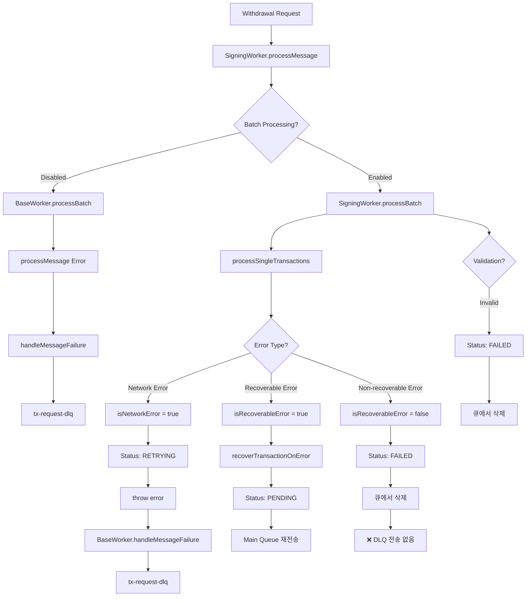
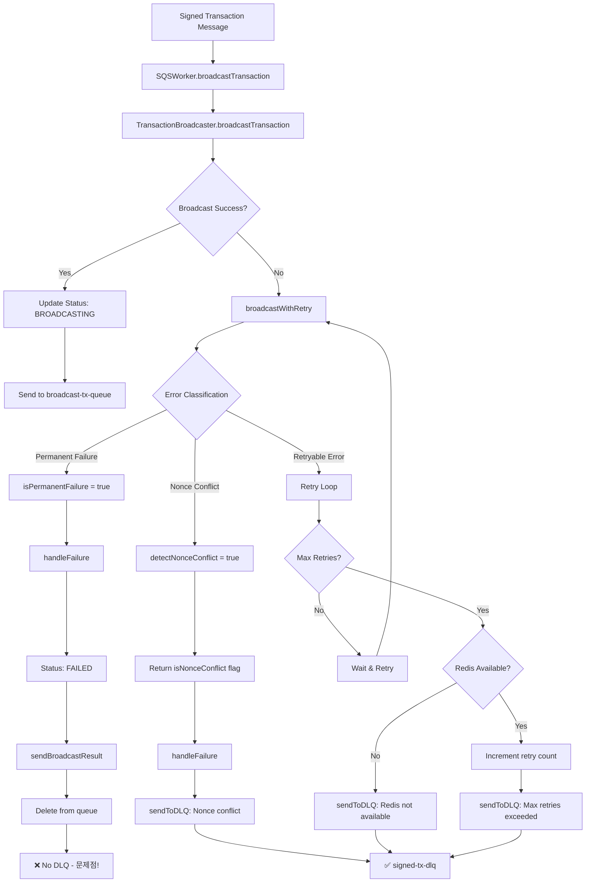
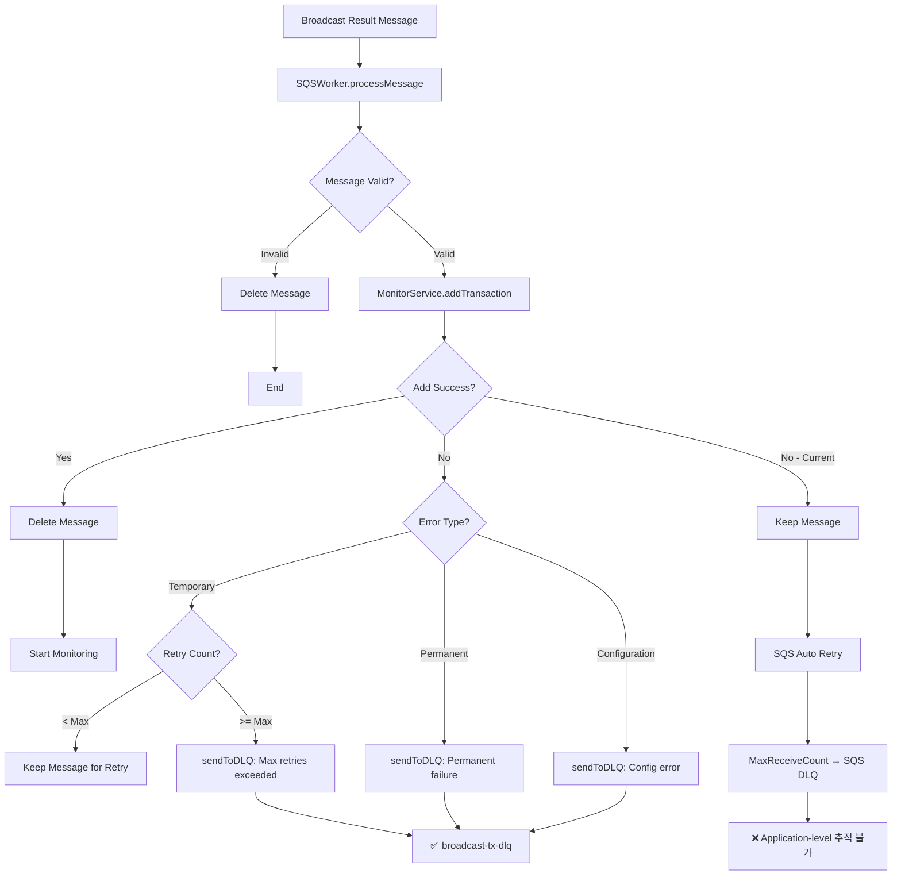

# DLQ (Dead Letter Queue) Handling Documentation

## Overview

Asset Withdrawal System에서 DLQ(Dead Letter Queue)는 처리에 실패한 메시지들을 수집하고 관리하는 핵심 메커니즘입니다. 시스템은 3개의 서로 다른 DLQ를 운영하여 각 처리 단계에서 발생하는 실패를 추적하고 복구할 수 있도록 합니다.

### DLQ 구조 개요

- **tx-request-dlq**: Signing 과정에서 실패한 withdrawal request 메시지
- **signed-tx-dlq**: Broadcasting 과정에서 실패한 signed transaction 메시지  
- **broadcast-tx-dlq**: 블록체인 전송 후 확인 과정에서 실패한 메시지

각 DLQ는 Recovery Service에 의해 모니터링되며, 에러 타입에 따라 적절한 복구 전략이 적용됩니다.

---

## 1. tx-request-dlq

### 1.1 개요

**목적**: SigningWorker에서 트랜잭션 서명 과정 중 발생한 실패 메시지를 처리  
**큐 이름**: `tx-request-dlq`  
**소스**: `SigningWorker` → `BaseWorker.handleMessageFailure()`  
**타겟**: `RecoveryService.DLQMonitor`  

tx-request-dlq는 withdrawal request가 서명 과정에서 실패했을 때 해당 메시지가 저장되는 큐입니다. 네트워크 연결 문제, DB 저장 실패, 서명 에러 등 다양한 원인으로 실패한 요청들이 이곳에 수집됩니다.

### 1.2 DLQ로 전송되는 조건

#### 1.2.1 확실히 전송되는 경우 ✅

**네트워크/연결 에러**
- RPC 노드 연결 타임아웃 (`ETIMEDOUT`, `ECONNREFUSED`, `ENOTFOUND`)
- WebSocket 연결 끊김 (`Blockchain connection lost`)  
- ChainId 불일치 (`ChainId verification failed`)
- ChainId 검증 타임아웃 (`ChainId verification pending or failed`)

**DB 저장 실패**
- 서명은 성공했으나 signed transaction DB 저장 실패
- `Failed to save signed transaction` 에러

**코드 참조**: 
- `SigningWorker.processMessage()` lines 1600-1617 (네트워크 에러)
- `SigningWorker.processMessage()` lines 1571-1580 (DB 저장 실패)

#### 1.2.2 조건부 전송 (배치 처리 설정 의존) ⚠️

**배치 처리 비활성화 시** (`batchProcessing.enabled = false`):
- **모든 에러**가 DLQ로 전송됨 (BaseWorker.processBatch() 사용)

**배치 처리 활성화 시** (`batchProcessing.enabled = true`, 기본값):
- **네트워크 에러만** DLQ로 전송
- 다른 에러들은 `processSingleTransactions()`에서 별도 처리

#### 1.2.3 전송되지 않는 경우 ❌

**검증 실패**
- Invalid withdrawal request 검증 실패
- 상태: `FAILED`로 표시 후 큐에서 삭제
- 위치: `SigningWorker.processBatch()` lines 441-473

**가스 추정 실패**  
- Gas estimation 실패
- 상태: `FAILED`로 표시 후 큐에서 삭제
- 위치: `SigningWorker.processSingleTransactions()` lines 825-850

**복구 가능한 에러 (배치 처리 활성화 시)**
- Nonce 충돌 (`nonce too low`, `nonce has already been used`)
- 가스비 부족 (`insufficient funds`, `insufficient balance`)
- 토큰 승인 부족 (`insufficient allowance`)
- 가스 한도 초과 (`gas required exceeds`)
- 처리: `recoverTransactionOnError()` 호출 → 메인 큐로 재전송

**🚨 복구 불가능한 에러 (배치 처리 활성화 시)**
- Private key 에러, 기타 non-recoverable 에러
- **문제점**: DLQ로 전송되지 않고 큐에서 삭제됨
- 위치: `SigningWorker.processSingleTransactions()` lines 950-973

### 1.3 에러 플로우 다이어그램



### 1.4 메시지 구조

tx-request-dlq에 저장되는 메시지 구조:

```typescript
interface DLQMessage<WithdrawalRequest> {
  // 원본 withdrawal request 데이터
  originalMessage: {
    id: string;
    network: string;
    toAddress: string;
    amount: string;
    tokenAddress?: string;
    symbol?: string;
    chain: string;
    createdAt: Date;
  };
  
  // 에러 정보
  error: {
    type: DLQErrorType;           // NETWORK_ERROR, VALIDATION_ERROR 등
    code?: string;                // 구체적인 에러 코드
    message: string;              // 에러 메시지
    details?: any;                // 추가 세부 정보
  };
  
  // 메타 데이터
  meta: {
    timestamp: string;            // DLQ 전송 시각 (ISO 8601)
    attemptCount: number;         // 시도 횟수 (보통 1)
  };
}
```

### 1.5 에러 타입 분류

Recovery Service에서 사용하는 에러 타입 분류:

```typescript
enum DLQErrorType {
  NETWORK_ERROR = 'NETWORK_ERROR',        // 네트워크 연결 문제
  VALIDATION_ERROR = 'VALIDATION_ERROR',  // 입력 데이터 검증 실패  
  INSUFFICIENT_FUNDS = 'INSUFFICIENT_FUNDS', // 잔액 부족
  NONCE_ERROR = 'NONCE_ERROR',            // Nonce 충돌/에러
  GAS_ERROR = 'GAS_ERROR',                // 가스 관련 에러
  SIGNING_ERROR = 'SIGNING_ERROR',        // 서명 프로세스 에러
  DATABASE_ERROR = 'DATABASE_ERROR',      // DB 저장 에러
  UNKNOWN_ERROR = 'UNKNOWN_ERROR'         // 분류되지 않은 에러
}
```

### 1.6 코드 레퍼런스

**주요 에러 처리 위치:**

1. **BaseWorker.handleMessageFailure()** (lines 280-318)
   ```typescript
   // 모든 에러를 DLQ로 전송하는 기본 메커니즘
   await this.sendToDLQ(message, error, 1);
   await this.inputQueue.deleteMessage(message.receiptHandle);
   ```

2. **SigningWorker.processMessage()** (lines 1384-1653)  
   ```typescript
   // 네트워크 에러 처리
   if (isNetworkError(error)) {
     await this.withdrawalRequestService.updateStatusWithError(
       requestId, TransactionStatus.RETRYING, `Network error: ${error.message}`
     );
     throw error; // → BaseWorker → DLQ
   }
   ```

3. **SigningWorker.processSingleTransactions()** (lines 825-999)
   ```typescript
   // 복구 불가능한 에러가 DLQ로 가지 않는 문제점
   if (isRecoverable) {
     await this.queueRecoveryService.recoverTransactionOnError(...);
   } else {
     await this.inputQueue.deleteMessage(message.receiptHandle); // ❌
   }
   ```

### 1.7 현재 시스템의 문제점

#### 🚨 Critical Issue: 데이터 손실 위험

**문제**: 배치 처리가 활성화된 상태(기본값)에서 복구 불가능한 서명 에러들이 DLQ로 전송되지 않고 큐에서 삭제됨

**영향**:
- Private key 문제, 설정 오류 등 중요한 에러 정보 손실
- 실패한 트랜잭션 추적 불가능
- 시스템 장애 원인 분석 어려움
- 수동 복구 기회 상실

**예시 케이스**:
```typescript
// 이런 에러들이 DLQ로 가지 않음
- "invalid private key"  
- "signer configuration error"
- "unsupported network"
- 기타 non-recoverable signing errors
```

#### ⚠️ Inconsistent Behavior: 일관되지 않은 동작

**문제**: 배치 처리 설정에 따라 동일한 에러가 다르게 처리됨

| 에러 타입 | 배치 처리 OFF | 배치 처리 ON (기본값) |
|-----------|---------------|----------------------|
| Network Error | DLQ | DLQ |  
| Nonce Collision | DLQ | 메인 큐 재전송 |
| Insufficient Funds | DLQ | 메인 큐 재전송 |
| Private Key Error | DLQ | **삭제 (손실)** |
| DB Save Error | DLQ | DLQ |

### 1.8 개선 제안

#### 1. 모든 에러를 DLQ로 전송
```typescript
// processSingleTransactions()에서 DLQ 전송 추가
} else {
  // Non-recoverable error - send to DLQ before deletion  
  await this.handleMessageFailure(message, error);
  // Delete handled by handleMessageFailure
}
```

#### 2. 에러 분류 개선
- ErrorClassifier를 사용한 일관된 에러 타입 분류
- 복구 전략별 세부 에러 코드 추가

#### 3. 모니터링 강화
- DLQ 메시지 수 실시간 모니터링
- 에러 타입별 알림 설정
- 복구 불가능 에러 즉시 알림

### 1.9 Recovery 전략

Recovery Service에서 tx-request-dlq 메시지 처리 전략:

**네트워크 에러**: 
- 지수 백오프로 재시도
- 최대 5회 재시도 후 수동 확인

**DB 저장 에러**:
- 즉시 재시도 (1회)
- 실패 시 수동 처리 큐로 이동

**복구 불가능 에러**:
- 알림 발송
- 수동 검토 대기
- 설정/환경 문제 조사

### 1.10 모니터링 및 알림

#### 메트릭스
- `tx_request_dlq_message_count`: DLQ 메시지 총 수
- `tx_request_dlq_error_type_count`: 에러 타입별 메시지 수  
- `tx_request_dlq_processing_time`: DLQ 메시지 처리 시간

#### 알림 규칙
- DLQ 메시지 100개 이상: Warning  
- Private key/설정 에러 발생: Critical
- 네트워크 에러 연속 10회: Warning
- DB 에러 발생: Critical

### 1.11 트러블슈팅 가이드

#### 일반적인 문제 해결

**Q: tx-request-dlq에 메시지가 계속 쌓이는 경우**
```bash
# DLQ 메시지 확인
aws sqs receive-message --queue-url <dlq-url> --max-number-of-messages 10

# 에러 타입별 분석  
grep "NETWORK_ERROR\|SIGNING_ERROR" logs/signing-worker.log

# Recovery Service 상태 확인
docker logs signing-recovery-service
```

**Q: 복구 가능한 에러가 DLQ에 있는 경우**
- 배치 처리 설정 확인: `batchProcessing.enabled`
- 네트워크 연결 상태 점검
- RPC 노드 응답 시간 확인

**Q: 메시지가 DLQ로 가지 않는 경우**  
- 배치 처리 활성화 여부 확인
- 에러 타입이 recoverable인지 확인
- 로그에서 "deleteMessage" 호출 확인

#### 로그 분석

**중요한 로그 패턴:**
```bash
# DLQ 전송 확인
grep "Message sent to DLQ" logs/signing-worker.log

# 복구 불가능 에러 확인  
grep "Non-recoverable error" logs/signing-worker.log

# 메시지 삭제 확인
grep "deleteMessage" logs/signing-worker.log
```

---

## 2. signed-tx-dlq

### 2.1 개요

**목적**: tx-broadcaster에서 서명된 트랜잭션을 블록체인에 브로드캐스트하는 과정 중 발생한 실패 메시지를 처리  
**큐 이름**: `signed-tx-dlq`  
**소스**: `SQSWorker` (tx-broadcaster) → `SQSWorker.sendToDLQ()`  
**타겟**: `RecoveryService.DLQMonitor`  

signed-tx-dlq는 서명된 트랜잭션이 블록체인에 브로드캐스트되는 과정에서 실패했을 때 해당 메시지가 저장되는 큐입니다. 네트워크 문제, Nonce 충돌, 재시도 횟수 초과 등 다양한 원인으로 실패한 브로드캐스트 요청들이 이곳에 수집됩니다.

### 2.2 DLQ로 전송되는 조건

#### 2.2.1 확실히 전송되는 경우 ✅

**최대 재시도 횟수 초과**
- Redis에서 재시도 카운트 추적 (`retryCount >= maxRetries`)
- 기본 최대 재시도: 3회
- 재시도 가능한 에러가 지속되어 한계 도달 시

**Nonce 충돌 감지**
- `NONCE_TOO_LOW`: 이미 사용된 nonce로 브로드캐스트 시도
- `NONCE_TOO_HIGH`: Nonce gap이 발생한 경우
- `REPLACEMENT_UNDERPRICED`: 동일 nonce, 낮은 가스비로 교체 시도
- Nonce Manager의 상태와 블록체인 상태 불일치

**Redis 서비스 사용 불가**
- Redis 연결 실패 또는 오류 시
- 재시도 카운트 추적 불가능한 상태
- 안전을 위해 모든 실패 메시지를 DLQ로 전송

**코드 참조**: 
- `SQSWorker.handleFailure()` lines 1133-1141 (Redis 없음)
- `SQSWorker.handleFailure()` lines 1150-1163 (최대 재시도)
- `SQSWorker.broadcastWithRetry()` lines 969-989 (Nonce 충돌)

#### 2.2.2 전송되지 않는 경우 ❌

**🚨 영구 실패 (Permanent Failures)**
```typescript
// PERMANENT_FAILURE_TYPES에 정의된 에러들
- INSUFFICIENT_FUNDS    // 잔액 부족
- INVALID_TRANSACTION   // 유효하지 않은 트랜잭션
- EXECUTION_REVERTED    // 스마트 컨트랙트 실행 실패  
- UNKNOWN              // 알 수 없는 에러
```
처리 방식: 즉시 `FAILED` 상태로 표시 후 큐에서 삭제 (DLQ 전송 없음)

**재시도 가능한 에러 (재시도 중)**
- 네트워크 일시 장애
- RPC 노드 응답 지연
- 가스비 추정 실패 (일시적)
- 재시도 횟수가 최대치에 도달하지 않은 경우

### 2.3 에러 플로우 다이어그램



### 2.4 메시지 구조

signed-tx-dlq에 저장되는 메시지 구조:

```typescript
interface DLQMessage<UnifiedSignedTransactionMessage> {
  // 원본 서명된 트랜잭션 데이터
  originalMessage: {
    id: string;                    // 메시지 고유 ID
    transactionType: 'SINGLE' | 'BATCH';
    
    // 단일 트랜잭션인 경우
    withdrawalId?: string;         // withdrawal request ID
    
    // 배치 트랜잭션인 경우  
    batchId?: string;              // batch ID
    
    // 트랜잭션 정보
    signedTransaction: string;     // 서명된 raw transaction (0x...)
    transactionHash?: string;      // 트랜잭션 해시
    nonce: number;                 // Nonce 값
    gasLimit: string;              // 가스 한도
    maxFeePerGas: string;          // 최대 가스비
    maxPriorityFeePerGas: string;  // 우선순위 가스비
    fromAddress: string;           // 송신자 주소
    toAddress: string;             // 수신자 주소
    value: string;                 // 전송 금액 (Wei)
    data?: string;                 // 트랜잭션 데이터
    chain: string;                 // 체인명 (polygon, ethereum 등)
    network: string;               // 네트워크 (mainnet, testnet 등)
  };
  
  // 에러 정보
  error: {
    type: DLQErrorType;           // NONCE_ERROR, NETWORK_ERROR 등
    code?: string;                // 구체적인 에러 코드
    message: string;              // 에러 메시지
    details?: any;                // 추가 세부 정보
  };
  
  // 메타 데이터
  meta: {
    timestamp: string;            // DLQ 전송 시각 (ISO 8601)
    attemptCount: number;         // 브로드캐스트 시도 횟수
  };
}
```

### 2.5 에러 타입별 처리 전략

**Nonce 에러**:
```typescript
NONCE_TOO_LOW      // 이미 사용된 nonce → DLQ
NONCE_TOO_HIGH     // Nonce gap 발생 → DLQ  
NONCE_EXPIRED      // Nonce 만료 → 영구 실패
```

**네트워크 에러**:
```typescript  
NETWORK_ERROR      // 연결 문제 → 재시도 후 DLQ
TIMEOUT           // 타임아웃 → 재시도 후 DLQ
SERVER_ERROR      // RPC 서버 에러 → 재시도 후 DLQ
```

**트랜잭션 에러**:
```typescript
INSUFFICIENT_FUNDS     // 잔액 부족 → 영구 실패 (DLQ 없음!)
INVALID_TRANSACTION    // 유효하지 않음 → 영구 실패 (DLQ 없음!)
EXECUTION_REVERTED     // 실행 실패 → 영구 실패 (DLQ 없음!)
```

### 2.6 코드 레퍼런스

**주요 DLQ 전송 위치:**

1. **SQSWorker.sendToDLQ()** (lines 1243-1295)
   ```typescript
   private async sendToDLQ(
     message: UnifiedSignedTransactionMessage,
     error: any
   ): Promise<void> {
     const errorInfo = ErrorClassifier.classifyError(error);
     // DLQ 메시지 구성 및 전송
   }
   ```

2. **SQSWorker.handleFailure()** (lines 1071-1207)  
   ```typescript
   // 영구 실패 처리
   if (isPermanentFailure(errorInfo.type)) {
     await this.transactionService.updateToFailed(...);
     await this.queueService.deleteMessage(...); // DLQ 없음
   }
   
   // 재시도 횟수 초과
   if (retryCount >= maxRetries) {
     await this.sendToDLQ(unifiedMessage, result.error);
   }
   ```

3. **SQSWorker.broadcastWithRetry()** (lines 918-1069)
   ```typescript
   // Nonce 충돌 감지
   const nonceConflict = this.retryService.detectNonceConflict(error);
   if (nonceConflict.isNonceConflict) {
     return { isNonceConflict: true, error: `Nonce conflict: ...` };
   }
   ```

### 2.7 현재 시스템의 문제점

#### 🚨 Critical Issue: 영구 실패 데이터 손실

**문제**: 영구 실패로 분류된 에러들이 DLQ로 전송되지 않고 즉시 삭제됨

**영향**:
- 잔액 부족, 스마트 컨트랙트 실행 실패 등 중요한 실패 정보 손실
- 실패 원인 분석 및 디버깅 불가능
- 수동 복구나 재처리 기회 상실
- 사용자에게 명확한 실패 원인 제공 어려움

**예시 케이스**:
```typescript
// 이런 중요한 에러들이 DLQ로 가지 않음
INSUFFICIENT_FUNDS     // 사용자 잔액 부족
INVALID_TRANSACTION    // 트랜잭션 형식 오류
EXECUTION_REVERTED     // 스마트 컨트랙트 로직 에러
UNKNOWN               // 분류되지 않은 중요 에러
```

#### ⚠️ Redis 의존성 문제

**문제**: Redis 없이는 재시도 추적 불가능, 모든 실패가 DLQ로 감

**영향**:
- Redis 장애 시 불필요한 DLQ 메시지 증가
- 실제 복구 필요한 메시지와 구분 어려움
- 시스템 복원력 저하

#### ⚠️ Nonce 관리 복잡성

**문제**: Nonce 충돌 복구가 복잡하고 수동 개입 필요

**영향**:
- Nonce gap 발생 시 후속 트랜잭션 모두 실패
- 자동 복구 메커니즘 부족
- 운영 부담 증가

### 2.8 개선 제안

#### 1. 영구 실패도 DLQ로 전송
```typescript
// handleFailure()에서 영구 실패도 DLQ 전송
if (isPermanentFailure(errorInfo.type)) {
  // Send to DLQ before marking as FAILED
  await this.sendToDLQ(unifiedMessage, result.error);
  await this.transactionService.updateToFailed(...);
}
```

#### 2. 에러 분류 세분화
- 복구 가능한 영구 실패 vs 진짜 영구 실패
- 사용자 오류 vs 시스템 오류 구분
- 우선순위별 처리 전략

#### 3. Nonce 복구 자동화
- Nonce gap 자동 감지 및 복구
- 후속 트랜잭션 자동 재정렬
- 병렬 처리 시 Nonce 동기화

### 2.9 Recovery 전략

Recovery Service에서 signed-tx-dlq 메시지 처리 전략:

**Nonce 충돌**: 
- Nonce Manager 상태 동기화
- Gap 해결 후 트랜잭션 재전송
- 후속 트랜잭션 순서 조정

**네트워크 에러**:
- 지수 백오프로 재시도
- 다른 RPC 엔드포인트로 시도
- 최대 재시도 후 수동 확인

**영구 실패 (개선 후)**:
- 실패 원인 분석 및 분류
- 사용자 알림 발송
- 수동 검토 대기열로 이동

### 2.10 모니터링 및 알림

#### 메트릭스
- `signed_tx_dlq_message_count`: DLQ 메시지 총 수
- `signed_tx_dlq_nonce_conflict_count`: Nonce 충돌 메시지 수  
- `signed_tx_dlq_permanent_failure_count`: 영구 실패 메시지 수
- `signed_tx_dlq_processing_time`: DLQ 메시지 처리 시간
- `broadcast_retry_count_by_error`: 에러별 재시도 횟수

#### 알림 규칙
- DLQ 메시지 50개 이상: Warning  
- Nonce 충돌 연속 5회: Critical
- 영구 실패 발생: Info (개선 후)
- Redis 연결 실패: Critical

### 2.11 트러블슈팅 가이드

#### 일반적인 문제 해결

**Q: signed-tx-dlq에 Nonce 충돌 메시지가 쌓이는 경우**
```bash
# Nonce 상태 확인
redis-cli GET "nonce:polygon:mainnet:0x..."

# 블록체인 실제 nonce 확인  
cast nonce 0x... --rpc-url <rpc-endpoint>

# Recovery Service 로그 확인
grep "Nonce conflict" logs/recovery-service.log
```

**Q: 영구 실패 메시지가 DLQ에 없는 경우**
- 현재 시스템 설계상 정상 (문제점)
- `FAILED` 상태로 표시된 트랜잭션 DB에서 확인
- 개선 필요: 모든 실패를 DLQ로 전송

**Q: Redis 없이 모든 메시지가 DLQ로 가는 경우**  
- Redis 연결 상태 점검
- 재시도 로직이 정상 작동하지 않음
- Redis 복원 후 DLQ 메시지 재처리

#### 로그 분석

**중요한 로그 패턴:**
```bash
# DLQ 전송 확인
grep "Message sent to DLQ" logs/tx-broadcaster.log

# Nonce 충돌 확인  
grep "Nonce conflict detected" logs/tx-broadcaster.log

# 영구 실패 확인
grep "Permanent failure detected" logs/tx-broadcaster.log

# 재시도 횟수 초과
grep "Max retries exceeded" logs/tx-broadcaster.log
```

---

## 3. broadcast-tx-dlq

### 3.1 개요

**목적**: tx-monitor에서 트랜잭션 모니터링 과정 중 발생한 실패 메시지를 처리 (예정)  
**큐 이름**: `broadcast-tx-dlq`  
**현재 상태**: ⚠️ **미구현** - 환경 설정은 되어 있으나 실제로 사용되지 않음  
**예정된 소스**: `SQSWorker` (tx-monitor)  
**예정된 타겟**: `RecoveryService.DLQMonitor`  

broadcast-tx-dlq는 브로드캐스트된 트랜잭션의 모니터링 과정에서 실패했을 때 해당 메시지가 저장될 예정인 큐입니다. 현재는 구성만 되어 있고 실제 DLQ 전송 로직이 구현되지 않은 상태입니다.

### 3.2 현재 상황

#### 3.2.1 설정은 완료, 구현은 미완료 ⚠️

**환경 설정 완료**:
- `BROADCAST_TX_DLQ_URL` 환경 변수 정의됨
- RecoveryService에서 모니터링 대상 큐로 등록됨
- SQS 큐는 물리적으로 존재함

**실제 구현 미완료**:
- tx-monitor/SQSWorker에 `sendToDLQ()` 메서드 없음
- 에러 발생 시 DLQ 전송 로직 없음
- 모든 에러 처리가 SQS 자체 재시도 메커니즘에 의존

#### 3.2.2 현재 에러 처리 방식

**tx-monitor/SQSWorker.processMessage() (lines 100-207)**:
```typescript
} catch (error) {
  logger.error('[SQSWorker] Error processing message:', error);
  // Don't delete message on error - let it retry
  // The message will go to DLQ after max retries
}
```

**현재 처리 플로우**:
1. broadcast-tx-queue에서 메시지 수신
2. 처리 실패 시 메시지를 삭제하지 않음
3. SQS visibility timeout 후 자동 재시도
4. MaxReceiveCount 도달 시 SQS 자체 DLQ로 이동
5. **문제**: 애플리케이션 레벨의 DLQ 처리 없음

**MonitorService.checkTransaction() (lines 145-300)**:
```typescript
// Mark as failed after max retries
if (monitoredTx.retryCount >= config.monitoring.maxRetries) {
  monitoredTx.status = 'FAILED';
  await this.updateTransactionStatus(monitoredTx, null);
  this.activeTransactions.delete(txHash);
  // No DLQ handling here
}
```

### 3.3 예상되는 DLQ 케이스 (구현 시)

#### 3.3.1 모니터링 실패 케이스

**RPC 노드 연결 실패**:
- Provider 생성 실패
- Network timeout
- Invalid RPC endpoint

**트랜잭션 조회 실패**:
- `getTransactionReceipt()` 실패
- `getTransaction()` 실패  
- `getBlockNumber()` 실패

**체인 상태 문제**:
- Chain reorganization
- Node synchronization issues
- Inconsistent chain state

**DB 업데이트 실패**:
- Transaction status update 실패
- Connection timeout
- Constraint violation

#### 3.3.2 영구 실패 케이스

**잘못된 데이터**:
- Invalid transaction hash format
- Non-existent transaction hash
- Malformed message structure

**설정 오류**:
- Unsupported chain/network
- Missing chain configuration
- Provider configuration error

**시스템 제한**:
- 최대 재시도 횟수 초과
- Monitoring timeout 도달
- Resource exhaustion

### 3.4 에러 플로우 다이어그램 (구현 예정)



### 3.5 예상 메시지 구조 (구현 시)

broadcast-tx-dlq에 저장될 메시지 구조:

```typescript
interface DLQMessage<UnifiedBroadcastResultMessage> {
  // 원본 브로드캐스트 결과 데이터
  originalMessage: {
    id: string;                      // 메시지 고유 ID
    transactionType: 'SINGLE' | 'BATCH';
    
    // 단일 트랜잭션인 경우
    withdrawalId?: string;           // withdrawal request ID
    
    // 배치 트랜잭션인 경우
    batchId?: string;                // batch ID
    
    // 브로드캐스트 결과 정보
    broadcastTransactionHash: string; // 브로드캐스트된 트랜잭션 해시
    status: 'success' | 'failed';    // 브로드캐스트 상태
    blockNumber?: number;            // 포함된 블록 번호
    chain: string;                   // 체인명 (polygon, ethereum 등)
    network: string;                 // 네트워크 (mainnet, testnet 등)
    
    // 에러 정보 (실패한 브로드캐스트의 경우)
    error?: string;                  // 브로드캐스트 에러 메시지
    
    // 메타데이터
    timestamp: string;               // 브로드캐스트 시각
  };
  
  // 모니터링 실패 에러 정보
  error: {
    type: DLQErrorType;             // MONITORING_ERROR, NETWORK_ERROR 등
    code?: string;                  // 구체적인 에러 코드
    message: string;                // 에러 메시지
    details?: {
      retryCount?: number;          // 재시도 횟수
      lastAttempt?: string;         // 마지막 시도 시각
      chainState?: any;             // 체인 상태 정보
      providerError?: string;       // Provider 에러 상세
    };
  };
  
  // 메타 데이터
  meta: {
    timestamp: string;              // DLQ 전송 시각 (ISO 8601)
    attemptCount: number;           // 모니터링 시도 횟수
    processingTime?: number;        // 처리 소요 시간 (ms)
  };
}
```

### 3.6 구현 제안

#### 3.6.1 DLQ 전송 로직 추가

**tx-monitor/SQSWorker에 sendToDLQ() 메서드 구현**:
```typescript
private async sendToDLQ(
  message: UnifiedBroadcastResultMessage,
  error: any
): Promise<void> {
  if (!config.BROADCAST_TX_DLQ_URL) {
    logger.error('Broadcast DLQ URL not configured');
    return;
  }

  const errorInfo = ErrorClassifier.classifyError(error);
  const dlqMessage: DLQMessage<UnifiedBroadcastResultMessage> = {
    originalMessage: message,
    error: {
      type: errorInfo.type,
      code: errorInfo.code,
      message: error?.message || String(error),
      details: errorInfo.details,
    },
    meta: {
      timestamp: new Date().toISOString(),
      attemptCount: (message as any).attemptCount || 1,
    },
  };

  await this.sqs.sendMessage({
    QueueUrl: config.BROADCAST_TX_DLQ_URL,
    MessageBody: JSON.stringify(dlqMessage),
  }).promise();
}
```

**processMessage()에서 에러 처리 개선**:
```typescript
} catch (error) {
  logger.error('[SQSWorker] Error processing message:', error);
  
  const errorInfo = ErrorClassifier.classifyError(error);
  if (isPermanentFailure(errorInfo.type)) {
    // Permanent failures go to DLQ immediately
    await this.sendToDLQ(broadcastResult, error);
    await this.deleteMessage(queueUrl, message.ReceiptHandle);
  } else {
    // Temporary failures - check retry count
    const retryCount = await this.getRetryCount(message.MessageId);
    if (retryCount >= MAX_RETRIES) {
      await this.sendToDLQ(broadcastResult, error);
      await this.deleteMessage(queueUrl, message.ReceiptHandle);
    }
    // Otherwise let SQS retry
  }
}
```

#### 3.6.2 에러 타입별 처리 전략

**모니터링 에러 타입 정의**:
```typescript
enum MonitoringErrorType {
  NETWORK_ERROR = 'NETWORK_ERROR',          // RPC 연결 문제
  TRANSACTION_NOT_FOUND = 'TRANSACTION_NOT_FOUND', // 트랜잭션 없음
  CHAIN_SYNC_ERROR = 'CHAIN_SYNC_ERROR',    // 체인 동기화 문제
  PROVIDER_ERROR = 'PROVIDER_ERROR',        // Provider 설정 오류
  DATABASE_ERROR = 'DATABASE_ERROR',        // DB 업데이트 실패
  CONFIGURATION_ERROR = 'CONFIGURATION_ERROR', // 설정 오류
  TIMEOUT_ERROR = 'TIMEOUT_ERROR',          // 처리 타임아웃
}
```

**처리 전략**:
- **일시적 에러**: 재시도 (NETWORK_ERROR, TIMEOUT_ERROR)
- **영구 에러**: DLQ 즉시 전송 (CONFIGURATION_ERROR, TRANSACTION_NOT_FOUND)
- **중간 에러**: 제한된 재시도 후 DLQ (DATABASE_ERROR, PROVIDER_ERROR)

#### 3.6.3 MonitorService 개선

**checkTransaction()에서 DLQ 지원**:
```typescript
// Mark as failed after max retries
if (monitoredTx.retryCount >= config.monitoring.maxRetries) {
  monitoredTx.status = 'FAILED';
  await this.updateTransactionStatus(monitoredTx, null);
  
  // Send monitoring failure to DLQ
  const monitoringError = new Error(
    `Monitoring failed after ${config.monitoring.maxRetries} retries`
  );
  await this.sendMonitoringFailureToDLQ(monitoredTx, monitoringError);
  
  this.activeTransactions.delete(txHash);
}
```

### 3.7 구현 우선순위

#### 3.7.1 현재 상태 평가

**Low Priority (현재)**:
- SQS 자체 재시도 메커니즘으로 어느 정도 커버됨
- MaxReceiveCount 설정으로 무한 재시도 방지
- 즉각적인 시스템 안정성 문제는 없음

**하지만 필요한 이유**:
- 모니터링 실패 원인 분석 부족
- 애플리케이션 레벨의 에러 추적 불가
- Recovery Service와의 통합 부족

#### 3.7.2 구현 단계

1. **Phase 1**: DLQ 전송 로직 기본 구현
2. **Phase 2**: 에러 분류 및 재시도 전략 고도화
3. **Phase 3**: Recovery Service 통합
4. **Phase 4**: 모니터링 및 알림 시스템 연동

### 3.8 현재 시스템의 한계점

#### 3.8.1 에러 추적 부족

**문제**: 애플리케이션 레벨의 DLQ 처리 없음으로 세밀한 에러 분석 불가

**영향**:
- 모니터링 실패 원인 파악 어려움
- 시스템 개선점 식별 부족
- 운영 인사이트 부족

#### 3.8.2 Recovery Service 미연동

**문제**: broadcast-tx-dlq 구성은 되어 있으나 실제 메시지가 없음

**영향**:
- Recovery Service의 broadcast 관련 기능 미활용
- 전체 DLQ 생태계 불완전

### 3.9 모니터링 및 알림 (구현 시)

#### 메트릭스
- `broadcast_tx_dlq_message_count`: DLQ 메시지 총 수
- `monitoring_failure_count_by_type`: 에러 타입별 모니터링 실패 수
- `transaction_monitoring_timeout_count`: 모니터링 타임아웃 횟수
- `rpc_connection_failure_count`: RPC 연결 실패 횟수

#### 알림 규칙
- DLQ 메시지 30개 이상: Warning
- RPC 연결 실패 연속 5회: Critical  
- 설정 에러 발생: Critical
- DB 업데이트 실패: Warning

### 3.10 트러블슈팅 가이드

#### 현재 상태에서의 문제 해결

**Q: 모니터링이 실패하는 트랜잭션들을 추적하고 싶은 경우**
- 현재는 애플리케이션 로그에만 의존
- SQS 콘솔에서 DLQ 메시지 확인 (MaxReceiveCount 초과한 경우)
- CloudWatch 메트릭스로 처리 실패율 모니터링

**Q: broadcast-tx-dlq에 메시지가 없는 경우**
- 정상: 현재 구현되지 않음
- SQS 콘솔에서 원본 큐의 DLQ 확인
- CloudWatch Logs에서 에러 패턴 검색

**Q: Recovery Service에서 broadcast-tx-dlq 처리 안 되는 경우**
- 현재 메시지가 없으므로 정상
- 구현 후 Recovery Service 재시작 필요

#### 구현 후 예상 문제 해결

**모니터링 실패가 계속되는 경우**:
```bash
# RPC 노드 상태 확인
curl -X POST -H "Content-Type: application/json" \
  --data '{"jsonrpc":"2.0","method":"eth_blockNumber","params":[],"id":1}' \
  <RPC_ENDPOINT>

# DLQ 메시지 확인
aws sqs receive-message --queue-url <broadcast-dlq-url> --max-number-of-messages 10

# 에러 패턴 분석
grep "monitoring failure" logs/tx-monitor.log | head -20
```

**중요한 로그 패턴 (구현 시)**:
```bash
# DLQ 전송 확인
grep "Sent to broadcast DLQ" logs/tx-monitor.log

# 모니터링 실패 확인
grep "Monitoring failed after.*retries" logs/tx-monitor.log

# RPC 에러 확인  
grep "RPC.*error\|Provider.*error" logs/tx-monitor.log
```

---

*이 문서는 Asset Withdrawal System의 전체 DLQ 처리 메커니즘에 대한 상세한 분석입니다. tx-request-dlq와 signed-tx-dlq는 현재 활발히 사용되고 있으며, broadcast-tx-dlq는 향후 구현이 필요한 상태입니다.*