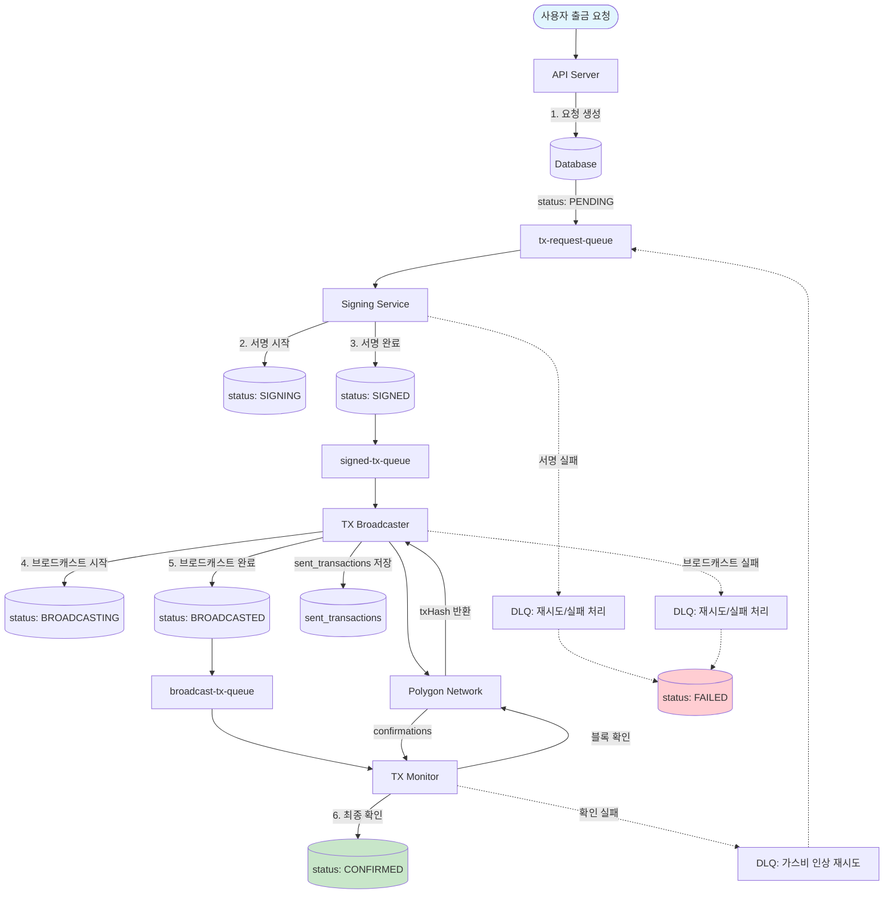
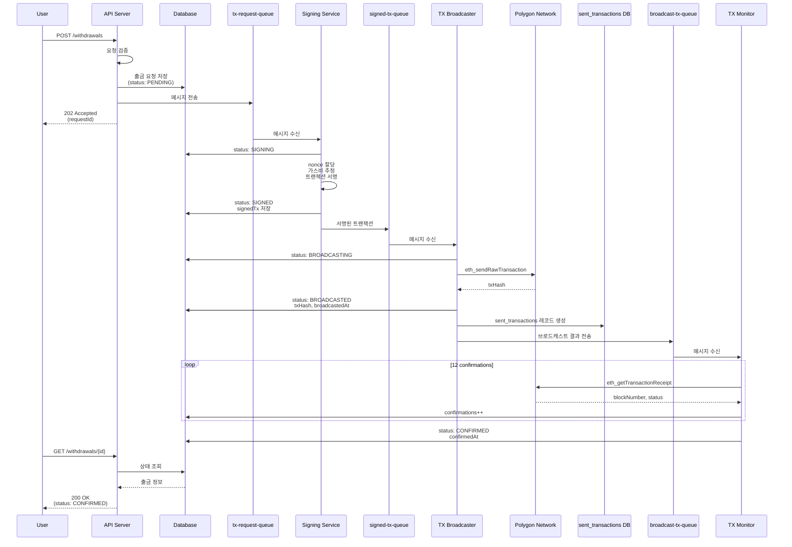
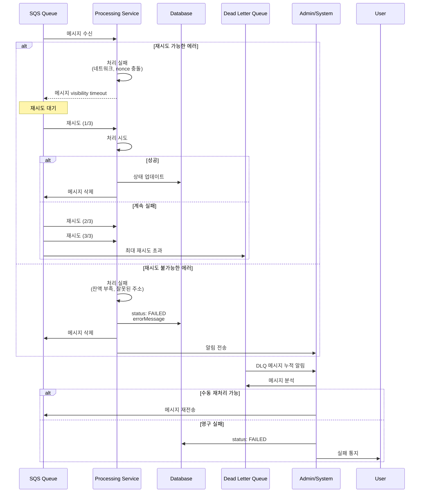
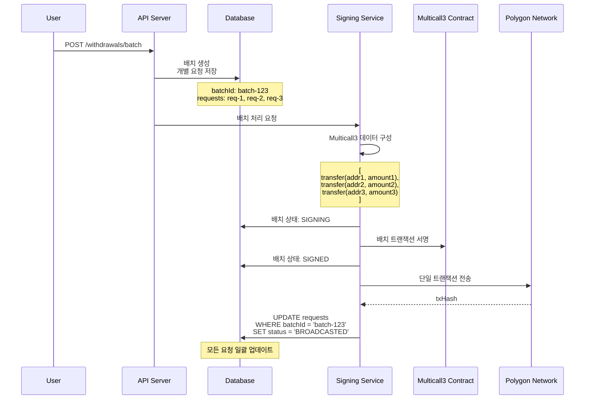
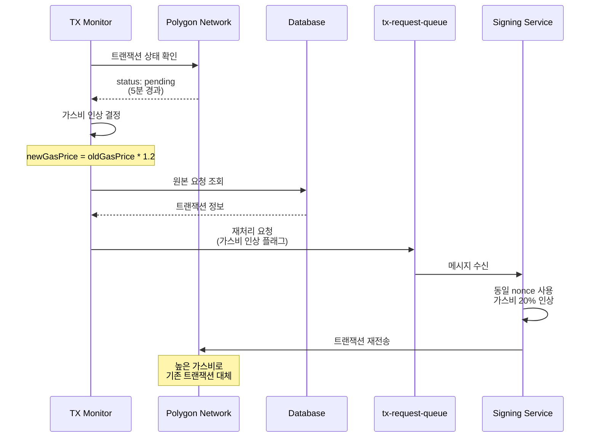

# 트랜잭션 라이프사이클 (Transaction Lifecycle)

## 개요

이 문서는 Asset Withdrawal System에서 출금 요청이 생성되어 블록체인에서 최종 확인될 때까지의 전체 라이프사이클을 설명합니다.

## 트랜잭션 상태 (Transaction Status)

```typescript
enum TransactionStatus {
  PENDING = 'PENDING', // 초기 요청 상태
  VALIDATING = 'VALIDATING', // 유효성 검증 중
  SIGNING = 'SIGNING', // 서명 진행 중
  SIGNED = 'SIGNED', // 서명 완료
  BROADCASTING = 'BROADCASTING', // 브로드캐스트 진행 중
  BROADCASTED = 'BROADCASTED', // 브로드캐스트 완료 (txHash 생성)
  CONFIRMED = 'CONFIRMED', // 블록체인 확인 완료
  FAILED = 'FAILED', // 실패
  CANCELED = 'CANCELED', // 취소됨
}
```

## 데이터 저장소

트랜잭션 라이프사이클에서 사용되는 주요 데이터 저장소와 각각의 역할:

### withdrawal_requests 테이블

- **역할**: 출금 요청의 전체 라이프사이클 상태 관리
- **주요 필드**: 요청 ID, 사용자 정보, 금액, 주소, 상태, 트랜잭션 해시
- **상태 전환**: PENDING → SIGNING → SIGNED → BROADCASTING → BROADCASTED → CONFIRMED/FAILED

### sent_transactions 테이블

- **역할**: 실제 블록체인에 전송된 트랜잭션 정보 기록
- **용도**:
  - TX Broadcaster가 브로드캐스트 성공 시 기록 생성
  - 원본 트랜잭션 해시와 실제 전송된 해시 매핑
  - TX Monitor의 트랜잭션 확인 작업 지원
  - 가스비 사용량 및 블록 정보 추적
- **라이프사이클**: SENT → CONFIRMED/FAILED

## 전체 플로우 다이어그램



## 시퀀스 다이어그램

### 정상 플로우 (Success Flow)



### 에러 처리 플로우 (Error Handling Flow)



### 배치 트랜잭션 플로우 (Batch Transaction Flow)



### 가스비 인상 재시도 플로우 (Gas Price Retry Flow)



## 단계별 상세 설명

### 1. 출금 요청 생성 (PENDING)

**엔드포인트**: `POST /api/v1/withdrawals`

```json
{
  "amount": "100.5",
  "symbol": "USDT",
  "toAddress": "0x742d35Cc6634C0532925a3b844Bc9e7595f7F123",
  "tokenAddress": "0xc2132D05D31c914a87C6611C10748AEb04B58e8F",
  "chain": "polygon",
  "network": "amoy"
}
```

**처리 과정**:

1. API 서버가 요청 검증
2. DB에 출금 요청 저장 (status: PENDING)
3. tx-request-queue에 메시지 전송

### 2. 트랜잭션 서명 (SIGNING → SIGNED)

**서비스**: Signing Service

**처리 과정**:

1. tx-request-queue에서 메시지 수신
2. DB 상태 업데이트: PENDING → SIGNING
3. 트랜잭션 데이터 구성
   - nonce 관리
   - 가스비 추정
   - 트랜잭션 서명
4. DB 상태 업데이트: SIGNING → SIGNED
5. signed-tx-queue에 서명된 트랜잭션 전송

**실패 시나리오**:

- nonce 충돌: 재시도
- 가스비 추정 실패: DLQ로 이동
- 서명 실패: status → FAILED

### 3. 트랜잭션 브로드캐스트 (BROADCASTING → BROADCASTED)

**서비스**: TX Broadcaster

**처리 과정**:

1. signed-tx-queue에서 메시지 수신
2. DB 상태 업데이트: SIGNED → BROADCASTING
3. 블록체인에 트랜잭션 전송
4. txHash 수신
5. DB 업데이트:
   - status: BROADCASTING → BROADCASTED
   - txHash 저장
   - broadcastedAt 타임스탬프 저장
6. sent_transactions 테이블에 브로드캐스트 정보 저장:
   - 원본 트랜잭션 해시와 실제 전송된 트랜잭션 해시 매핑
   - 체인 ID, 블록 번호 등 메타데이터 저장
7. broadcast-tx-queue에 브로드캐스트 결과 전송

**실패 시나리오**:

- 네트워크 오류: 재시도 (최대 3회)
- 트랜잭션 거부: DLQ로 이동
- 중복 트랜잭션: 기존 txHash 사용

### 4. 트랜잭션 확인 (BROADCASTED → CONFIRMED)

**서비스**: TX Monitor

**처리 과정**:

1. broadcast-tx-queue에서 메시지 수신
2. 블록체인에서 트랜잭션 상태 조회
3. confirmation 수 추적 (목표: 12 confirmations)
4. DB 업데이트:
   - blockNumber 저장
   - gasUsed 저장
   - confirmations 수 업데이트
5. sent_transactions 테이블 업데이트:
   - 최종 확인된 블록 번호
   - 실제 사용된 가스비
   - 확인 타임스탬프
6. 12 confirmations 달성 시:
   - status: BROADCASTED → CONFIRMED
   - confirmedAt 타임스탬프 저장

**실패 시나리오**:

- 트랜잭션 실패: status → FAILED
- 장시간 pending: 가스비 인상 후 재시도
- 트랜잭션 소실: 재브로드캐스트

## 에러 처리 및 재시도 정책

### 재시도 가능한 에러

1. **네트워크 에러**
   - 최대 재시도: 3회
   - 백오프: 1초, 2초, 4초

2. **nonce 충돌**
   - 즉시 재시도
   - 새로운 nonce 할당

3. **가스 부족**
   - 가스비 20% 인상
   - 최대 재시도: 2회

### 재시도 불가능한 에러

1. **잔액 부족**
   - 즉시 실패 처리
   - 관리자 알림

2. **잘못된 주소**
   - 즉시 실패 처리
   - status → FAILED

3. **컨트랙트 실행 실패**
   - 트랜잭션 분석
   - 실패 사유 기록

## 배치 트랜잭션 처리

### 배치 생성

```json
{
  "batchId": "batch-123",
  "requests": [
    { "toAddress": "0x...", "amount": "100", "tokenAddress": "0x..." },
    { "toAddress": "0x...", "amount": "200", "tokenAddress": "0x..." }
  ]
}
```

### 배치 처리 흐름

1. **개별 요청 생성**: 각 요청을 PENDING 상태로 저장
2. **배치 서명**: Multicall3 컨트랙트 사용
3. **일괄 브로드캐스트**: 단일 트랜잭션으로 처리
4. **상태 동기화**: batchId로 모든 요청 상태 일괄 업데이트

### 배치 실패 처리

- **부분 실패**: 실패한 요청만 개별 재시도
- **전체 실패**: 배치 크기 축소 후 재시도

## 모니터링 및 알림

### 주요 메트릭

1. **트랜잭션 처리 시간**
   - 요청 → 서명: 평균 2초
   - 서명 → 브로드캐스트: 평균 1초
   - 브로드캐스트 → 확인: 평균 3-5분

2. **성공률**
   - 목표: 99.5% 이상
   - 실패 원인 분석

3. **가스비 효율성**
   - 배치 vs 개별 처리 비교
   - 최적 배치 크기 분석

### 알림 트리거

1. **즉시 알림**
   - 시스템 잔액 부족
   - 서명 키 접근 실패
   - RPC 노드 연결 실패

2. **지연 알림**
   - 5분 이상 pending 트랜잭션
   - 실패율 5% 초과
   - DLQ 메시지 누적

## 큐 시스템 아키텍처

### 큐 목록 및 용도

1. **tx-request-queue**
   - 생산자: API Server (출금 요청 생성 시)
   - 소비자: Signing Service
   - 용도: 서명되지 않은 트랜잭션 요청 전달

2. **signed-tx-queue**
   - 생산자: Signing Service
   - 소비자: TX Broadcaster
   - 용도: 서명 완료된 트랜잭션 전달

3. **broadcast-tx-queue**
   - 생산자: TX Broadcaster
   - 소비자: TX Monitor
   - 용도: 브로드캐스트 완료된 트랜잭션 결과 및 모니터링 요청 전달
   - 메시지 형식: UnifiedBroadcastResultMessage (단일/배치 트랜잭션 지원)

### 메시지 흐름

```
API → tx-request-queue → Signing Service
     → signed-tx-queue → TX Broadcaster
     → broadcast-tx-queue → TX Monitor
```

### Dead Letter Queue (DLQ)

각 큐는 대응하는 DLQ를 가지고 있습니다:

- tx-request-dlq
- signed-tx-dlq
- broadcast-tx-dlq

최대 재시도 횟수(기본 3회)를 초과한 메시지는 자동으로 DLQ로 이동됩니다.

## 보안 고려사항

1. **서명 키 관리**
   - AWS KMS 또는 HSM 사용
   - 키 로테이션 정책

2. **트랜잭션 검증**
   - 금액 한도 검증
   - 수신 주소 화이트리스트
   - 중복 요청 방지

3. **감사 로그**
   - 모든 상태 변경 기록
   - 실패 사유 추적
   - 관리자 액션 로깅

## API 응답 예시

### 성공 응답

```json
{
  "requestId": "req-123",
  "status": "CONFIRMED",
  "txHash": "0x1234567890abcdef...",
  "blockNumber": 12345678,
  "confirmations": 12,
  "gasUsed": "21000",
  "broadcastedAt": "2024-01-01T12:00:00Z",
  "confirmedAt": "2024-01-01T12:05:00Z"
}
```

### 실패 응답

```json
{
  "requestId": "req-456",
  "status": "FAILED",
  "error": {
    "code": "INSUFFICIENT_FUNDS",
    "message": "Insufficient balance for transaction",
    "details": {
      "required": "100.5",
      "available": "50.0"
    }
  },
  "failedAt": "2024-01-01T12:00:30Z"
}
```

## 관련 문서

- [API Documentation](./API.md)
- [Technical Design](../TECHNICAL_DESIGN.md)
- [Setup Guide](../SETUP.md)
